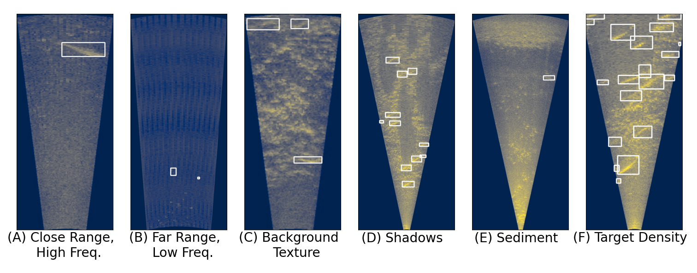

<!--  -->


# The Caltech Fish Counting Dataset

### Updates

- **2024-07-16:** Version 1.1 released! This version includes exactly the same data as the original release, but focuses on improving the ease of access and dataset setup. These updates include:
    - Individual downloads for each training, validation, and testing location (vs. one large download in v1.0)
    - Pre-processed images to reproduce our Baseline++ results (vs. required conversion step in v1.0)
    - COCO and YOLO-formatted labels for training object detectors without data wrangling (vs. MOTChallenge-only labels in v1.0)

## Overview

Official resources for [The Caltech Fish Counting Dataset: A Benchmark for Multiple-Object Tracking and Counting](https://arxiv.org/abs/2207.09295) (ECCV 2022).

## Data Download

Data can be downloaded from CaltechDATA using the following links.

**Images**

| Image Format  | Data Subset |
|---|---|
| Raw (1-channel grayscale, Baseline format) | [Kenai (train/validation)](https://data.caltech.edu/records/g945x-41103/files/kenai.tar?download=1) \| [Rightbank (test)](https://data.caltech.edu/records/g945x-41103/files/rightbank.tar?download=1) \| [Channel (test)](https://data.caltech.edu/records/g945x-41103/files/channel.tar?download=1) \| [Elwha (test)](https://data.caltech.edu/records/g945x-41103/files/elwha.tar?download=1) \| [Nushagak (test)](https://data.caltech.edu/records/g945x-41103/files/nushagak.tar?download=1) |
| 3-channel, Baseline++ format | [Kenai (train/validation)](https://data.caltech.edu/records/g945x-41103/files/kenai-3channel.tar?download=1) \| [Rightbank (test)](https://data.caltech.edu/records/g945x-41103/files/rightbank-3channel.tar?download=1) \| [Channel (test)](https://data.caltech.edu/records/g945x-41103/files/channel-3channel.tar?download=1) \| [Elwha (test)](https://data.caltech.edu/records/g945x-41103/files/elwha-3channel.tar?download=1) \| [Nushagak (test)](https://data.caltech.edu/records/g945x-41103/files/nushagak-3channel.tar?download=1) |


**Labels**

| Label Format  | Downloads |
|---|---|
| YOLO | [Labels (.txt)](https://data.caltech.edu/records/g945x-41103/files/yolo_annotations_v1.1.zip?download=1) \| [File lists](https://data.caltech.edu/records/g945x-41103/files/file_lists_v1.1.zip?download=1) \| [YAML](https://data.caltech.edu/records/g945x-41103/files/cfc_v1.1.yaml?download=1) (all are required)|
| COCO | [Labels (.json)](https://data.caltech.edu/records/g945x-41103/files/coco_annotations_v1.1.zip?download=1) |
| MOTChallenge | [Labels (.txt)](https://data.caltech.edu/records/1y23m-j8r69/files/fish_counting_annotations.tar.gz?download=1) |

<details closed>
<summary><b>MOTChallenge format details</b></summary>

For MOTChallenge annotations, we use the default directory structure as described [here](https://github.com/JonathonLuiten/TrackEval/tree/master/docs/MOTChallenge-Official#data-format). After extracting the `tar.gz`, the directory structure is as follows:

```
annotations/
    kenai-train/
        One directory per video sequence in the training set.
                gt.txt
    kenai-val/
        One directory per video sequence in the validation set.
                gt.txt
    kenai-rightbank/
        ...
    kenai-channel/
        ...
    nushagak/
        ...
    elwha/
        ...
```

Following the MOTChallenge format, each `gt.txt` file contains one entry per track per frame. Each line contains 10 values:

```<frame_number>, <track_id>, <bb_left>, <bb_top>, <bb_width>, <bb_height>, <conf>, <x>, <y>, <z>```

The world coordinates `x,y,z` are ignored for 2D data and are filled with -1. For ground truth tracks, `conf=-1` as well. All frame numbers, target IDs and bounding boxes are 1-indexed (i.e. the minimum `bb_left` and `bb_top` values are 1, not 0). Here is an example:

```
1, 3, 794.27, 247.59, 71.245, 174.88, -1, -1, -1, -1
1, 6, 1648.1, 119.61, 66.504, 163.24, -1, -1, -1, -1
1, 8, 875.49, 399.98, 95.303, 233.93, -1, -1, -1, -1
```

</details>

<details closed>
<summary><b>Additional metadata</b></summary>

We also provide clip-level metadata for each video clip in the dataset: 

[Additional Metadata [54 KB]](https://data.caltech.edu/records/1y23m-j8r69/files/fish_counting_metadata.tar.gz?download=1)

One JSON file is provided for each location: `kenai-train.json`, `kenai-val.json`, `kenai-rightbank.json`, `kenai-channel.json`, `nushagak.json`, and `elwha.json`. Each JSON file contains a list of dictionaries, one per video clip. Each entry contains the following metadata:

```
{   // Information for a single clip
    "clip_name" :              // Unique ID for this clip; matches the name of the directory containing image frames
    "num_frames":              // Number of frames in the video clip
    "upstream_direction" :     // Either `left` or `right`
    "width":                   // Image width in pixels
    "height":                  // Image width in pixels
    "framerate":               // Video frame rate, in frames per second
    "x_meter_start":           // Meter distance from the sonar camera at x = 0
    "x_meter_stop":            // Meter distance from the sonar camera at x = width-1
    "y_meter_start":           // Meter distance from the sonar camera at y = 0
    "y_meter_stop":            // Meter distance from the sonar camera at y = height-1
}
```

</details>

## Object Detection

### Training YOLOv5 on CFC

To reproduce our object detection results, first clone and install [YOLOv5](https://github.com/ultralytics/yolov5).

Download the dataset and arrange it in the following directory structure:

```
yolov5/
    data/
        cfc_v1.1/
            images/ # un-tar'd images, either {location}.tar (Baseline) or {location}-3channel.tar (Baseline++).
                kenai/
                channel/
                ...
            labels/ # un-tar'd yolo_annotations_v1.1.zip
                kenai/
                channel/
                ... 
            file_lists/
                ...
            cfc_v1.1.yaml
```

Then replicate our training settings with:

```
python train.py --img 896 --epochs 150 --data data/cfc_v1.1/cfc_v1.1.yaml --weights yolov5m.pt
```

### Leaderboard

All metrics shown are AP@IoU=0.5 ("AP50").

| Method  | Kenai Validation | Rightbank Test | Channel Test | Elwha Test | Nushagak Test | Test Overall (Macro-Average)  | 
|---|---|---|---|---|---|---|
| CFC Baseline | 66.4 | 57.7 | 32.0 | 39.9 | 70.6 | 50.1 |
| CFC Baseline++ | 68.0 | 87.1 | 65.1 | 85.5 | 74.7 | 78.1 |

Please submit a PR to add yourself to the leaderboard!

## Multi-Object Tracking and Counting

More documentation, tracker code, and leaderboard coming soon.

## MOT Evaluation

Clone the repo **with submodules** to enable MOT evaluation:

```
git clone --recursive https://github.com/visipedia/caltech-fish-counting.git
// or 
git clone --recursive git@github.com:visipedia/caltech-fish-counting.git
```

If you already cloned, submodules can be retroactively intialized with:

```
git submodule init
git submodule update
```

We provide evaluation code using the [TrackEval](https://github.com/JonathonLuiten/TrackEval) codebase. In addition to the [CLEAR](https://link.springer.com/article/10.1155/2008/246309), [ID](https://arxiv.org/abs/1609.01775), and [HOTA](https://arxiv.org/abs/2009.07736) tracking metrics, we extend the TrackEval codebase with a custom metric `nMAE` as described in the paper:

, 

where  is the number of video clips,  is the absolute counting error for each clip:

, 

and  is the ground truth count for clip :


Run the evaluation script from the command line to reproduce the results from the paper:

```
python evaluate.py --results_dir PATH/TO/results --anno_dir PATH/TO/annotations --metadata_dir PATH/TO/metadata --tracker baseline
```
```
python evaluate.py --results_dir PATH/TO/results --anno_dir PATH/TO/annotations --metadata_dir PATH/TO/metadata --tracker baseline++
```

### Prediction Results

We provide output from our Baseline and Baseline++ methods in MOTChallenge format as well. 

[ECCV22 Baseline Results [18 MB]](https://data.caltech.edu/records/1y23m-j8r69/files/fish_counting_results.tar.gz?download=1)

- Running `md5sum` on the tar.gz file should produce: `ef8d517ad45419edce7af2e7dc5016be  fish_counting_results.tar.gz`

Note that the directory structure for predictions is different from the ground truth annotations. After extracting the `tar.gz`, the directory structure is as follows:

```
results/
    kenai-val/
        baseline/
            data/
                One text file per clip, named {clip_name}.txt
        baseline++/
            data/
                One text file per clip, named {clip_name}.txt
    kenai-rightbank/
        ...
    kenai-channel/
        ...
    nushagak/
        ...
    elwha/
        ...
```

## Reference

#### [The Caltech Fish Counting Dataset: A Benchmark for Multiple-Object Tracking and Counting](https://arxiv.org/abs/2207.09295)

[Justin Kay](https://justinkay.github.io), [Peter Kulits](https://kulits.github.io), [Suzanne Stathatos](https://suzanne-stathatos.github.io/), [Siqi Deng](https://www.amazon.science/author/siqi-deng), [Erik Young](https://home.tu.org/users/erikyoung), [Sara Beery](https://beerys.github.io/), [Grant Van Horn](https://gvanhorn38.github.io/), and [Pietro Perona](https://scholar.google.com/citations?user=j29kMCwAAAAJ)

We present the Caltech Fish Counting Dataset (CFC), a
large-scale dataset for detecting, tracking, and counting fish in sonar
videos. We identify sonar videos as a rich source of data for advancing low signal-to-noise computer vision applications and tackling domain generalization for multiple-object tracking (MOT) and counting.
In comparison to existing MOT and counting datasets, which are largely
restricted to videos of people and vehicles in cities, CFC is sourced from
a natural-world domain where targets are not easily resolvable and appearance features cannot be easily leveraged for target re-identification.
With over half a million annotations in over 1,500 videos sourced from
seven different sonar cameras, CFC allows researchers to train MOT and
counting algorithms and evaluate generalization performance at unseen
test locations. We perform extensive baseline experiments and identify
key challenges and opportunities for advancing the state of the art in
generalization in MOT and counting.

If you find our work useful in your research please consider citing our paper:

```
@inproceedings{cfc2022eccv,
    author    = {Kay, Justin and Kulits, Peter and Stathatos, Suzanne and Deng, Siqi and Young, Erik and Beery, Sara and Van Horn, Grant and Perona, Pietro},
    title     = {The Caltech Fish Counting Dataset: A Benchmark for Multiple-Object Tracking and Counting},
    booktitle = {European Conference on Computer Vision (ECCV)},
    year      = {2022}
}
```
