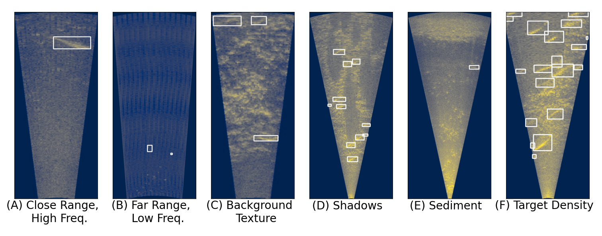

<!--  -->


# The Caltech Fish Counting Dataset

This repository includes:
- [x] Links to download the dataset and annotations
- [x] Evaluation code to reproduce our results and evaluate new algorithms
- [x] A script to convert raw sonar frames into the enhanced format used by the Baseline++ method in the paper

## Data Download

Data can be downloaded from CaltechDATA using the following links.

[Training, validation, and testing images [123 GB]](https://data.caltech.edu/tindfiles/serve/ff340630-a2bb-418b-9b54-91809c7af1cb/)

- Running `md5sum` on the tar.gz file should produce: `176648e618fc5013db972aa7ded01517  fish_counting_frames.tar.gz`

[Metadata [54 KB]](https://data.caltech.edu/tindfiles/serve/a69cdc3a-7082-403c-a656-03ab7aaa6b17/)

- Running `md5sum` on the tar.gz file should produce: `152286bd6f25f965aadf41e8a0c44140  fish_counting_metadata.tar.gz`

[Annotations [5.1 MB]](https://data.caltech.edu/tindfiles/serve/ec0efc6f-2b37-4535-b05e-c85f3a5f950d/)

- Running `md5sum` on the tar.gz file should produce: `34c6bbd5e9187f05bfc0be72df002b19  fish_counting_annotations.tar.gz`

**Tiny Dataset [1.44 GB]** [Link to download](link to download)

There is, alternatively, a tiny dataset which is a subset of the larger dataset. It includes data from all 6 river locations/subsets (elwha, kenai-channel, kenai-rightbank, kenai-train, kenai-val, nushagak). It has 20 clips (videos) from each river and up to 50 consecutive frames from each clip.

The formatting, etc. of each of the subdirectories and file structure follow the formats listed below.

- Running `md5sum` on the tar.gz file should produce `6ae6062d50a90d4b084ebe476a392c0e tiny_dataset.tar.gz` 

## Data Format

### Images

Frames are provided as single-channel JPGs. After extracting the `tar.gz`, frames are organized as follows. Each location described in the paper -- Kenai Left Bank (training & validation), Kenai Right Bank, Kenai Channel, Nushagak, and Elwha -- has its own directory, with subdirectories for each video clip at that location.

```
frames/
    raw/
        kenai-train/
            One directory per video sequence in the training set.
                Images are named by frame index in the video clip, e.g. 0.jpg, 1.jpg ...
        kenai-val/
            One directory per video sequence in the validation set.
                0.jpg, 1.jpg ...
        kenai-rightbank/
            ...
        kenai-channel/
            ...
        nushagak/
            ...
        elwha/
            ...
```     

The 3-channel frames used by our Baseline++ method can be generated using `convert.py`:

```
python convert.py --in_dir PATH/TO/frames/raw --out_dir PATH/TO/OUTPUT/DIRECTORY
```

The directory structure will be maintained.

### Metadata

Clip-level metadata is provided for each video clip in the dataset. One JSON file is provided for each location: `kenai-train.json`, `kenai-val.json`, `kenai-rightbank.json`, `kenai-channel.json`, `nushagak.json`, and `elwha.json`. Each JSON file contains a list of dictionaries, one per video clip. Each entry contains the following metadata:

```
{   // Information for a single clip
    "clip_name" :              // Unique ID for this clip; matches the name of the directory containing image frames
    "num_frames":              // Number of frames in the video clip
    "upstream_direction" :     // Either `left` or `right`
    "width":                   // Image width in pixels
    "height":                  // Image width in pixels
    "framerate":               // Video frame rate, in frames per second
    "x_meter_start":           // Meter distance from the sonar camera at x = 0
    "x_meter_stop":            // Meter distance from the sonar camera at x = width-1
    "y_meter_start":           // Meter distance from the sonar camera at y = 0
    "y_meter_stop":            // Meter distance from the sonar camera at y = height-1
}
```

### Annotations

We provide annotations in the MOTChallenge format and use the default directory structure as described [here](https://github.com/JonathonLuiten/TrackEval/tree/master/docs/MOTChallenge-Official#data-format). After extracting the `tar.gz`, the directory structure is as follows:

```
annotations/
    kenai-train/
        One directory per video sequence in the training set.
                gt.txt
    kenai-val/
        One directory per video sequence in the validation set.
                gt.txt
    kenai-rightbank/
        ...
    kenai-channel/
        ...
    nushagak/
        ...
    elwha/
        ...
```

Following the MOTChallenge format, each `gt.txt` file contains one entry per track per frame. Each line contains 10 values:

```<frame_number>, <track_id>, <bb_left>, <bb_top>, <bb_width>, <bb_height>, <conf>, <x>, <y>, <z>```

The world coordinates `x,y,z` are ignored for 2D data and are filled with -1. For ground truth tracks, `conf=-1` as well. All frame numbers, target IDs and bounding boxes are 1-indexed (i.e. the minimum `bb_left` and `bb_top` values are 1, not 0). Here is an example:

```
1, 3, 794.27, 247.59, 71.245, 174.88, -1, -1, -1, -1
1, 6, 1648.1, 119.61, 66.504, 163.24, -1, -1, -1, -1
1, 8, 875.49, 399.98, 95.303, 233.93, -1, -1, -1, -1
```


### Prediction Results

We provide output from our Baseline and Baseline++ methods in MOTChallenge format as well. 

[ECCV22 Baseline Results [18 MB]](https://data.caltech.edu/tindfiles/serve/c7312167-a622-47d2-a5ee-e9fe01cb77bf/)

- Running `md5sum` on the tar.gz file should produce: `ef8d517ad45419edce7af2e7dc5016be  fish_counting_results.tar.gz`

Note that the directory structure for predictions is different from the ground truth annotations. After extracting the `tar.gz`, the directory structure is as follows:

```
results/
    kenai-val/
        baseline/
            data/
                One text file per clip, named {clip_name}.txt
        baseline++/
            data/
                One text file per clip, named {clip_name}.txt
    kenai-rightbank/
        ...
    kenai-channel/
        ...
    nushagak/
        ...
    elwha/
        ...
```

## Repository Setup and Usage

### Installation

Clone the repo **with submodules** to enable MOT evaluation:

```
git clone --recursive https://github.com/visipedia/caltech-fish-counting.git
// or 
git clone --recursive git@github.com:visipedia/caltech-fish-counting.git
```

If you already cloned, submodules can be retroactively intialized with:

```
git submodule init
git submodule update
```

### Evaluation

We provide evaluation code using the [TrackEval](https://github.com/JonathonLuiten/TrackEval) codebase. In addition to the [CLEAR](https://link.springer.com/article/10.1155/2008/246309), [ID](https://arxiv.org/abs/1609.01775), and [HOTA](https://arxiv.org/abs/2009.07736) tracking metrics, we extend the TrackEval codebase with a custom metric `nMAE` as described in the paper:

, 

where  is the number of video clips,  is the absolute counting error for each clip:

, 

and  is the ground truth count for clip :


Run the evaluation script from the command line to reproduce the results from the paper:

```
python evaluate.py --results_dir PATH/TO/results --anno_dir PATH/TO/annotations --metadata_dir PATH/TO/metadata --tracker baseline
```
```
python evaluate.py --results_dir PATH/TO/results --anno_dir PATH/TO/annotations --metadata_dir PATH/TO/metadata --tracker baseline++
```

## Reference

#### The Caltech Fish Counting Dataset: A Benchmark for Multiple-Object Tracking and Counting

[Justin Kay](https://justinkay.github.io), [Peter Kulits](https://kulits.github.io), [Suzanne Stathatos](https://scholar.google.com/citations?user=JAAaAIcAAAAJ), [Siqi Deng](https://www.amazon.science/author/siqi-deng), [Erik Young](https://home.tu.org/users/erikyoung), [Sara Beery](https://beerys.github.io/), [Grant Van Horn](https://gvanhorn38.github.io/), and [Pietro Perona](https://scholar.google.com/citations?user=j29kMCwAAAAJ)

We present the Caltech Fish Counting Dataset (CFC), a
large-scale dataset for detecting, tracking, and counting fish in sonar
videos. We identify sonar videos as a rich source of data for advancing low signal-to-noise computer vision applications and tackling domain generalization for multiple-object tracking (MOT) and counting.
In comparison to existing MOT and counting datasets, which are largely
restricted to videos of people and vehicles in cities, CFC is sourced from
a natural-world domain where targets are not easily resolvable and appearance features cannot be easily leveraged for target re-identification.
With over half a million annotations in over 1,500 videos sourced from
seven different sonar cameras, CFC allows researchers to train MOT and
counting algorithms and evaluate generalization performance at unseen
test locations. We perform extensive baseline experiments and identify
key challenges and opportunities for advancing the state of the art in
generalization in MOT and counting.


```TODO: Bibtex```
