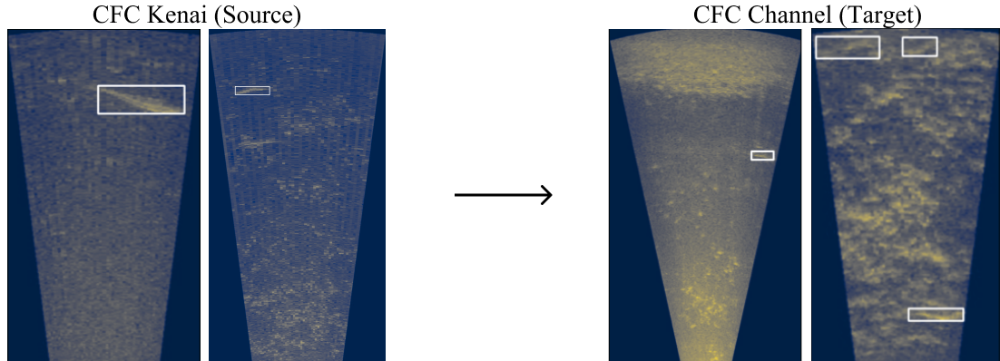

# CFC – Domain Adaptive Object Detection

This repository includes resources for the CFC – Domain Adaptive Object Detection (CFC-DAOD) dataset introduced in [Align and Distill: A Unifying and Extending Domain Adaptive Object Detection]() (2024, under review). It is an extension of the CFC Dataset (ECCV 2022) that includes additional data for unsupervised domain adaptation.

Below we provide download links for all data and annotations. Please see the [Align and Distill (ALDI)](https://bit.ly/48KVmfR) codebase to train DAOD models on CFC-DAOD.

## Data 

Like other DAOD benchmarks, CFC-DAOD consists of data from two domains, source and target.

- Source data
    - **Train:** In CFC-DAOD, the source-domain training set consists of training data from the original CFC data release, i.e., video frames from the 'Kenai left bank' location. We have used the 3-channel 'Baseline++' format introduced in the original CFC paper. For experiments in the ALDI paper, we subsampled empty frames to be around 10% of the total data, resulting in 76,619 training images. For reproducibility, we release the exact subsampled set below. When publishing results on CFC-DAOD, however, researchers are allowed to use the orignial CFC training set however they see fit and are not required to use our subsampled 'Baseline++' data.
    - **Validation** The CFC-DAOD Kenai (source) validation set is the same as the original CFC validation set. We use the 3-channel 'Baseline++' format from the original CFC paper. There are 30,454 validation images.

- Target data
    - **Train:** In CFC-DAOD, the target-domain 'training' set consists of **new data** from the 'Kenai Channel' location in CFC. These frames should be treated as *unlabeled* for DAOD methods, but labeled for Oracle methods. We also use the 'Baseline++' format. There are 29,089 target train images.
    - **Test:** The CFC-DAOD target-domain test set is the same as the 'Kenai Channel' test set from CFC. We use the 'Baseline++' format. There are 13,091 target test images. Researchers should publish final mAP@Iou=0.5 numbers on this data, and may use this data for model selection for fair comparison with prior methods.

**Labels:** All annotations are in [COCO](https://docs.aws.amazon.com/rekognition/latest/customlabels-dg/md-coco-overview.html) format.

### Download links

Data can be downloaded using the following links.

**Images:**

[CFC Kenai (source) train images (16 GB)](https://bit.ly/3wKOCBj)

- Running `md5sum cfc_train.zip` should return `935b4cd5ae5812035051f24e6707ee17  cfc_train.zip`

[CFC Kenai (source) val images (4.1 GB)](https://bit.ly/3v7jz1R)

- Running `md5sum cfc_val.zip` should return `e662ae8318621d1a636f0befadddaf48  cfc_val.zip`

[CFC Channel (target) train images (2.9 GB)](https://bit.ly/3TlXqGt)

- Running `md5sum cfc_channel_train.zip` should return `d17e0485674327df3d7611a5d6b999b1  cfc_channel_train.zip`

[CFC Channel (target) test images (2.8 GB)](https://bit.ly/3uQr8u1)

- Running `md5sum cfc_channel_test.zip` should return `9c15b9c9dc6784cce9dba21e81cb514a  cfc_channel_test.zip`

**Labels:**

[CFC Kenai (source) train labels](https://bit.ly/48EMZ5b)

[CFC Kenai (source) val labels](https://bit.ly/3V2v8Cc)

[CFC Channel (target) train labels](https://bit.ly/4c8jkVd)

[CFC Channel (target) test labels](https://bit.ly/49GF74E)